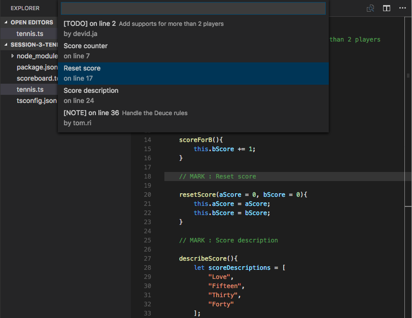

## Mark Jump

Jump to the marked section in the code

### What is Mark Jump?
Mark Jump is simply an extension that let you jump across your marking points in the code.

### How to use it?
Simply install the extension, Mark Jump should show the mark count in the status bar!
Use arrow keys to jump between them, click to jump to it.

You can also use the following key bindings to jump through various type of marks...

- `Ctrl+Alt+P` / `Ctrl+Cmd+P`: Jump to all marks in the project
- `Ctrl+Alt+M` / `Ctrl+Cmd+M`: Jump to all marks
- `Ctrl+Alt+S` / `Ctrl+Cmd+S`: Jump to all section marks
- `Ctrl+Alt+T` / `Ctrl+Cmd+T`: Jump to all TODOs
- `Ctrl+Alt+N` / `Ctrl+Cmd+N`: Jump to all Notes

### How to write the marks?
Just simply write one of these syntax in your code, Mark Jump will found it right away!

You can also add more syntax via the configurations (pull requests are welcomed).

#### Section Marks
- `// MARK: Section name`
- `# pragma Section name` (case sensitive)

#### TODOs
- `// TODO: Text goes here`
- `// TODO(writer name): Text goes here`

#### Notes
- `// NOTE: Text goes here`
- `// NOTE(writer name): Text goes here`
